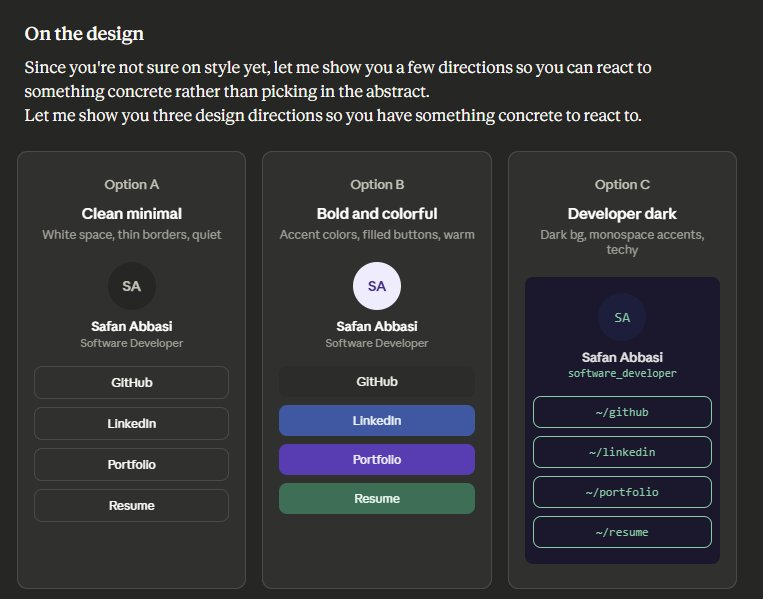
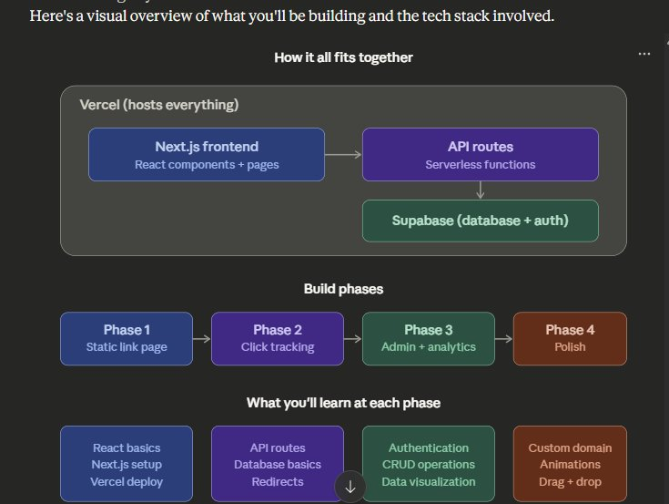

# LinkHub — Linktree Clone Implementation Plan

## Project overview

Build a personal "link-in-bio" web app for **Safan Abbasi** — a single-page site displaying profile info and links to GitHub, LinkedIn, portfolio, and resume. The app will be built with Next.js and deployed on Vercel. It will evolve across four phases from a static page to a full-stack app with click tracking, authentication, and an admin dashboard.

**Design direction:** Bold and colorful (Option B) — each link button has its own brand color, filled buttons, warm and modern feel.

### Design mockup



The chosen design (Option B, center) features:
- Colored avatar ring with initials
- Name and title centered below avatar
- Full-width buttons, each with a distinct brand color (dark gray for GitHub, blue for LinkedIn, purple for Portfolio, green for Resume)
- White text on colored backgrounds
- Rounded corners, hover scale effects
- Clean white or light gray page background

---

## Architecture and phases overview



---

## Tech stack

| Layer | Technology | Version | Purpose |
|-------|-----------|---------|---------|
| Framework | Next.js (App Router) | 16.2.1 | File-based routing, SSR, API routes |
| Runtime | React | 19.2.4 | UI library (required by Next.js 16) |
| Language | TypeScript | ^5 (stay on 5.x — Next.js 16 not yet tested with TS 6) | Type safety |
| Styling | Tailwind CSS | 4.x (CSS-first config — no `tailwind.config.ts`) | Utility-first CSS |
| Database | Supabase (PostgreSQL) | `@supabase/supabase-js` 2.x | Click tracking, link storage (Phase 2+) |
| SSR Auth | Supabase SSR | `@supabase/ssr` 0.9.x | Cookie-based auth for Next.js App Router (Phase 2+) |
| Auth | Supabase Auth | (included in supabase-js) | Admin dashboard protection (Phase 3+) |
| Icons | lucide-react | 1.x | Icon library for link buttons (Phase 1+) |
| Charts | Recharts | 3.x | Click analytics visualization (Phase 3+) |
| Animations | motion (formerly framer-motion) | 12.x | Page animations, micro-interactions (Phase 4) |
| Deployment | Vercel | — | Hosting, CI/CD, preview deploys |
| Version control | GitHub | — | New repo, separate from other projects |

> **Node.js 20.9+ is required** by Next.js 16. Ensure your local environment and Vercel deployment target meet this minimum.

---

## Phase 1 — Static link page (MVP)

### Goal
A beautiful, responsive, single-page link-in-bio site deployed live on Vercel.

### Project setup

The project has already been scaffolded with:

```bash
npx create-next-app@latest my-links --typescript --tailwind --eslint --app --src-dir --import-alias "@/*"
cd my-links
npm install lucide-react
```

### File structure

```
my-links/
├── src/
│   ├── app/
│   │   ├── layout.tsx          # Root layout (Geist font, metadata, global styles)
│   │   ├── page.tsx            # Main link page (home route "/")
│   │   ├── globals.css         # Tailwind v4 CSS-first config (@import "tailwindcss" + @theme)
│   │   └── favicon.ico
│   ├── components/
│   │   ├── LinkButton.tsx      # Reusable link button component
│   │   ├── ProfileHeader.tsx   # Avatar + name + bio section
│   │   └── Footer.tsx          # Small footer with credit
│   └── data/
│       └── links.ts            # Link data array
├── public/
│   ├── avatar.jpg              # Profile photo (square, min 200x200)
│   └── resume.pdf              # Resume file for download link
├── postcss.config.mjs          # Tailwind v4 PostCSS plugin (@tailwindcss/postcss)
├── next.config.ts              # Next.js config (React Compiler enabled)
├── package.json
└── tsconfig.json
```

> **Note:** Tailwind CSS v4 does not use a `tailwind.config.ts` file. Theme customization is done via `@theme` blocks in `globals.css`.

### Link data — `src/data/links.ts`

```typescript
export interface Link {
  id: string;
  label: string;
  url: string;
  bgColor: string;        // Hex color (applied via inline style, not Tailwind class)
  hoverColor: string;      // Slightly darker/lighter for hover
  icon?: string;           // Optional: icon name from lucide-react
}

export const links: Link[] = [
  {
    id: "github",
    label: "GitHub",
    url: "https://github.com/SafanAbbasi",
    bgColor: "#2C2C2A",
    hoverColor: "#444441",
    icon: "Github",
  },
  {
    id: "linkedin",
    label: "LinkedIn",
    url: "https://linkedin.com/in/safanabbasi",
    bgColor: "#185FA5",
    hoverColor: "#0C447C",
    icon: "Linkedin",
  },
  {
    id: "portfolio",
    label: "Portfolio",
    url: "https://safanabbasi.github.io",
    bgColor: "#534AB7",
    hoverColor: "#3C3489",
    icon: "Globe",
  },
  {
    id: "resume",
    label: "Resume / CV",
    url: "/resume.pdf",
    bgColor: "#0F6E56",
    hoverColor: "#085041",
    icon: "FileText",
  },
];

export const profile = {
  name: "Safan Abbasi",
  title: "Software Developer",
  bio: "Building things for the web.",  // Optional short tagline
  avatarUrl: "/avatar.jpg",
};
```

> **Note to Safan:** Update the bio to whatever you'd like. Add your avatar photo to `public/avatar.jpg` and your resume to `public/resume.pdf`.

### Component specs

#### `ProfileHeader.tsx`
- Circular avatar image (120x120px, `rounded-full`, slight border or shadow)
- Name in bold, larger text (`text-2xl font-bold`)
- Title/role below name in muted color (`text-gray-500`)
- Optional one-line bio below that
- Centered layout, generous top padding (`pt-16` or `pt-20`)

#### `LinkButton.tsx`
- Full-width button with rounded corners (`rounded-xl`)
- White text on colored background (color passed via props)
- Icon on the left side of the label (use `lucide-react` icons)
- Hover effect: slight scale up (`hover:scale-[1.03]`), color shift to `hoverColor`
- Smooth transition (`transition-all duration-200`)
- Opens link in new tab for external URLs (`target="_blank" rel="noopener noreferrer"`)
- Resume link can open in same tab or trigger download
- Min height ~52px, font-semibold, text centered

#### `Footer.tsx`
- Small, subtle text at bottom
- Something like "Built with Next.js & Vercel" or just "© 2026 Safan Abbasi"
- Muted color, small font size

#### `page.tsx` (main page)
- Outer container: `min-h-screen` with subtle background (light gray `bg-gray-50` or a very subtle gradient)
- Inner container: `max-w-md mx-auto px-6 py-8` (centers content, mobile-friendly width)
- Renders `ProfileHeader` at top
- Maps over `links` array to render `LinkButton` components in a vertical stack with `gap-4`
- Renders `Footer` at bottom

#### `layout.tsx`
- Uses Geist font (already configured via `next/font/google` in the scaffold)
- Set page metadata: title "Safan Abbasi — Links", description, Open Graph tags
- Wrap children in font class

### Design tokens

| Token | Value |
|-------|-------|
| Background | `#F9FAFB` (gray-50) or white |
| Card max-width | `max-w-md` (448px) |
| Button border-radius | `rounded-xl` (12px) |
| Button padding | `py-3.5 px-6` |
| Button text | White, `font-semibold`, `text-base` |
| Avatar size | 120x120px |
| Font | Geist (via `next/font/google`, already scaffolded) |
| Spacing between buttons | `gap-4` (16px) |

### Responsive behavior
- Mobile-first, single-column layout
- `max-w-md mx-auto` centers on desktop, fills on mobile
- Touch targets are 52px+ tall (accessible)

### Deployment to Vercel
1. Initialize git: `git init && git add . && git commit -m "initial commit"`
2. Create new GitHub repo named `my-links` (or `linkpage` or whatever you prefer)
3. Push to GitHub: `git remote add origin <repo-url> && git push -u origin main`
4. Go to vercel.com → "New Project" → import the GitHub repo → Deploy
5. Vercel auto-detects Next.js and handles everything
6. Site will be live at `my-links-safanabbasi.vercel.app` (customizable)

### Phase 1 acceptance criteria
- [ ] Page loads with profile header (avatar, name, title)
- [ ] Four link buttons render with correct colors and icons
- [ ] All links open correctly (GitHub, LinkedIn, portfolio in new tab; resume downloads)
- [ ] Hover effects work smoothly
- [ ] Page is responsive and looks good on mobile
- [ ] Deployed and accessible via Vercel URL
- [ ] Page metadata (title, description, OG image) is set

---

## Phase 2 — Click tracking

### Goal
Track how many times each link is clicked, stored in a real database.

### New dependencies

```bash
npm install @supabase/supabase-js @supabase/ssr
```

> **Why `@supabase/ssr`?** This package provides `createBrowserClient` and `createServerClient` for proper cookie-based auth in Next.js App Router. It replaces the deprecated `@supabase/auth-helpers-nextjs`. Required for Phase 3 auth but best to set up the client pattern correctly from the start.

### Supabase setup

1. Create a free Supabase project at supabase.com
2. Create a `clicks` table:

```sql
CREATE TABLE clicks (
  id BIGSERIAL PRIMARY KEY,
  link_id TEXT NOT NULL,
  clicked_at TIMESTAMPTZ DEFAULT NOW(),
  referrer TEXT,
  user_agent TEXT
);

CREATE INDEX idx_clicks_link_id ON clicks(link_id);
CREATE INDEX idx_clicks_clicked_at ON clicks(clicked_at);
```

3. Get the Supabase URL and publishable key from the project settings (Settings → API)

> **Note on API keys:** New Supabase projects (created after Nov 2025) use **publishable keys** (`sb_publishable_...`) instead of the legacy `anon` key. They are functionally equivalent and safe to expose to the browser — RLS protects the data. If your project still shows `anon`/`service_role` keys, they will continue to work but should be migrated eventually.

### Environment variables

Create `.env.local` in the project root (never commit this file):

```
NEXT_PUBLIC_SUPABASE_URL=https://your-project.supabase.co
NEXT_PUBLIC_SUPABASE_PUBLISHABLE_KEY=your-publishable-key-here
```

Also add a **server-only** key for route handlers (no `NEXT_PUBLIC_` prefix — never exposed to browser):

```
SUPABASE_SECRET_KEY=your-secret-key-here
```

Add all three variables in Vercel dashboard under Settings → Environment Variables.

### New files

```
src/
├── lib/
│   ├── supabase/
│   │   ├── server.ts           # Server-side Supabase client (for route handlers)
│   │   └── client.ts           # Browser-side Supabase client (for client components)
├── app/
│   └── api/
│       └── click/
│           └── route.ts        # POST endpoint to log clicks
```

#### `src/lib/supabase/server.ts`

Server-side client for use in route handlers, server components, and server actions:

```typescript
import { createClient } from "@supabase/supabase-js";

export function createServerSupabaseClient() {
  return createClient(
    process.env.NEXT_PUBLIC_SUPABASE_URL!,
    process.env.SUPABASE_SECRET_KEY!
  );
}
```

> **Why a server-only key?** Route handlers run on the server — using the secret key here bypasses RLS, which is fine for trusted server code like click tracking. For Phase 3, we'll add a cookie-based client using `@supabase/ssr` that respects RLS based on the logged-in user.

#### `src/lib/supabase/client.ts`

Browser-side client for use in client components (needed in Phase 3 for auth):

```typescript
import { createBrowserClient } from "@supabase/ssr";

export function createBrowserSupabaseClient() {
  return createBrowserClient(
    process.env.NEXT_PUBLIC_SUPABASE_URL!,
    process.env.NEXT_PUBLIC_SUPABASE_PUBLISHABLE_KEY!
  );
}
```

#### `src/app/api/click/route.ts`

```typescript
import { NextRequest, NextResponse } from "next/server";
import { createServerSupabaseClient } from "@/lib/supabase/server";

export async function POST(request: NextRequest) {
  const { linkId } = await request.json();
  const supabase = createServerSupabaseClient();

  const { error } = await supabase.from("clicks").insert({
    link_id: linkId,
    referrer: request.headers.get("referer") || null,
    user_agent: request.headers.get("user-agent") || null,
  });

  if (error) {
    return NextResponse.json({ error: error.message }, { status: 500 });
  }

  return NextResponse.json({ success: true });
}
```

### Modify `LinkButton.tsx`

Change from a simple `<a>` tag to a component that:
1. On click, fires a `fetch("/api/click", { method: "POST", body: JSON.stringify({ linkId }) })` call
2. Simultaneously navigates the user to the URL (don't wait for the API response — use `navigator.sendBeacon` or fire-and-forget fetch)
3. The tracking should be non-blocking — the user should never notice a delay

```typescript
"use client";

import { Link } from "@/data/links";

export default function LinkButton({ link }: { link: Link }) {
  const handleClick = () => {
    // Fire and forget — don't await
    fetch("/api/click", {
      method: "POST",
      headers: { "Content-Type": "application/json" },
      body: JSON.stringify({ linkId: link.id }),
    }).catch(() => {}); // Silently fail — tracking should never block UX
  };

  return (
    <a
      href={link.url}
      target="_blank"
      rel="noopener noreferrer"
      onClick={handleClick}
      className="..."
      style={{ backgroundColor: link.bgColor }}
    >
      {link.label}
    </a>
  );
}
```

### Supabase Row Level Security (RLS)

Enable RLS on the `clicks` table and add a policy that allows inserts from the publishable key but restricts reads to authenticated users only (for Phase 3):

```sql
ALTER TABLE clicks ENABLE ROW LEVEL SECURITY;

-- Anyone can insert (for tracking)
CREATE POLICY "Allow anonymous inserts" ON clicks
  FOR INSERT WITH CHECK (true);

-- Only authenticated users can read (for admin dashboard)
CREATE POLICY "Allow authenticated reads" ON clicks
  FOR SELECT USING (auth.role() = 'authenticated');
```

### Phase 2 acceptance criteria
- [ ] Clicking a link logs an entry in the Supabase `clicks` table
- [ ] Click tracking is non-blocking (user experiences no delay)
- [ ] Referrer and user agent are captured
- [ ] Environment variables are set in both `.env.local` and Vercel
- [ ] RLS is enabled with appropriate policies

---

## Phase 3 — Admin dashboard + analytics

### Goal
A password-protected admin page showing click analytics and the ability to manage links.

### New dependencies

```bash
npm install recharts
```

### Supabase auth setup

1. In the Supabase dashboard, create a single admin user (email + password) under Authentication → Users
2. Disable public sign-ups in Authentication → Settings (since only you need access)

### New files

```
src/
├── app/
│   ├── admin/
│   │   ├── page.tsx            # Admin dashboard (protected)
│   │   └── login/
│   │       └── page.tsx        # Login page
│   └── api/
│       ├── click/
│       │   └── route.ts        # (existing) POST for tracking
│       └── analytics/
│           └── route.ts        # GET for fetching click data
├── components/
│   ├── ClickChart.tsx          # Bar/line chart of clicks over time
│   ├── LinkStats.tsx           # Per-link click count cards
│   └── AdminNav.tsx            # Simple admin navigation/logout
├── lib/
│   └── supabase/
│       └── middleware.ts       # Supabase auth token refresh helper
proxy.ts                        # Next.js 16 proxy (replaces middleware.ts)
```

> **Important — Next.js 16 rename:** The `middleware.ts` file convention has been **renamed to `proxy.ts`** in Next.js 16. The exported function must also be named `proxy` (not `middleware`). See the proxy section below.

### Database changes — links table

Move link data from a static file to the database so you can manage it from the admin panel:

```sql
CREATE TABLE links (
  id TEXT PRIMARY KEY,
  label TEXT NOT NULL,
  url TEXT NOT NULL,
  bg_color TEXT NOT NULL,
  hover_color TEXT NOT NULL,
  icon TEXT,
  sort_order INTEGER DEFAULT 0,
  is_active BOOLEAN DEFAULT true,
  created_at TIMESTAMPTZ DEFAULT NOW()
);

-- Seed with initial data
INSERT INTO links (id, label, url, bg_color, hover_color, icon, sort_order) VALUES
  ('github', 'GitHub', 'https://github.com/SafanAbbasi', '#2C2C2A', '#444441', 'Github', 1),
  ('linkedin', 'LinkedIn', 'https://linkedin.com/in/safanabbasi', '#185FA5', '#0C447C', 'Linkedin', 2),
  ('portfolio', 'Portfolio', 'https://safanabbasi.github.io', '#534AB7', '#3C3489', 'Globe', 3),
  ('resume', 'Resume / CV', '/resume.pdf', '#0F6E56', '#085041', 'FileText', 4);

-- RLS policies
ALTER TABLE links ENABLE ROW LEVEL SECURITY;

CREATE POLICY "Anyone can read active links" ON links
  FOR SELECT USING (is_active = true);

CREATE POLICY "Authenticated users can do anything" ON links
  FOR ALL USING (auth.role() = 'authenticated');
```

### Proxy for auth token refresh — `proxy.ts`

In Next.js 16, the middleware file convention has been renamed from `middleware.ts` to **`proxy.ts`**. This proxy refreshes expired Supabase auth tokens on every request so that server components can read the session from cookies:

```typescript
import { type NextRequest, NextResponse } from "next/server";
import { createServerClient } from "@supabase/ssr";

export async function proxy(request: NextRequest) {
  let response = NextResponse.next({ request });

  const supabase = createServerClient(
    process.env.NEXT_PUBLIC_SUPABASE_URL!,
    process.env.NEXT_PUBLIC_SUPABASE_PUBLISHABLE_KEY!,
    {
      cookies: {
        getAll() {
          return request.cookies.getAll();
        },
        setAll(cookiesToSet) {
          cookiesToSet.forEach(({ name, value }) =>
            request.cookies.set(name, value)
          );
          response = NextResponse.next({ request });
          cookiesToSet.forEach(({ name, value, options }) =>
            response.cookies.set(name, value, options)
          );
        },
      },
    }
  );

  // Refresh the auth token — important for server components
  await supabase.auth.getUser();

  return response;
}

export const config = {
  matcher: [
    "/((?!_next/static|_next/image|favicon.ico|.*\\.(?:svg|png|jpg|jpeg|gif|webp)$).*)",
  ],
};
```

> **Important:** Always use `getUser()` on the server, not `getSession()`. `getUser()` validates the token against the Supabase Auth server. `getSession()` reads from local data and should not be trusted for authorization decisions.

### `GET /api/analytics/route.ts`

Returns aggregated click data. Should require authentication (validate with `getUser()`):

```typescript
// Returns:
// - Total clicks per link (all time)
// - Clicks per day for the last 30 days
// - Total click count
```

### Admin dashboard page (`/admin/page.tsx`)

- **Auth guard:** On load, check if user is authenticated via Supabase `getUser()`. If not, redirect to `/admin/login`.
- **Summary cards at top:** Total clicks (all time), clicks this week, most popular link
- **Bar chart:** Clicks per link (horizontal bar chart, colored by link color)
- **Line chart:** Clicks over time (last 30 days)
- **Links management table:** List all links with edit/delete/toggle active buttons
- **Add link form:** Simple form to add a new link (label, URL, color picker)
- **Logout button** in the nav

### Admin login page (`/admin/login/page.tsx`)

- Simple email + password form
- Uses the browser Supabase client (`createBrowserSupabaseClient`) from `@/lib/supabase/client`
- Calls `supabase.auth.signInWithPassword()`
- On success, redirects to `/admin`
- Shows error message on failure
- Minimal styling, centered on page

### Phase 3 acceptance criteria
- [ ] Login page works with Supabase auth via `@supabase/ssr`
- [ ] `proxy.ts` refreshes auth tokens on every request
- [ ] Unauthenticated users are redirected from `/admin` to `/admin/login`
- [ ] Dashboard shows total clicks, clicks per link, clicks over time chart
- [ ] Can add, edit, deactivate links from the admin panel
- [ ] Main page (`/`) now fetches links from Supabase instead of static file
- [ ] Logout works correctly

---

## Phase 4 — Polish and extras

### Goal
Refine the experience and add nice-to-have features.

### Possible enhancements (pick and choose)

**Custom domain**
- Buy a domain (e.g., `safanabbasi.dev` or `links.safanabbasi.dev`)
- Add it in Vercel dashboard → Settings → Domains
- Vercel handles SSL automatically

**Animations and micro-interactions**
- Staggered entrance animation on page load (buttons fade/slide in one by one)
- Use Motion (formerly Framer Motion): `npm install motion` — import from `motion/react`
- Subtle hover lift effect on buttons (already partially done with `hover:scale`)
- Loading skeleton on admin dashboard while data fetches

**Open Graph / social preview**
- Generate a dynamic OG image using `next/og` (Vercel's built-in OG image generation)
- Shows your name, avatar, and "Check out my links" when shared on social media
- Create `src/app/opengraph-image.tsx` using the ImageResponse API

**Drag-to-reorder links (admin)**
- Use `@dnd-kit/core` and `@dnd-kit/sortable` for drag-and-drop
- Update `sort_order` in Supabase on drop
- Satisfying UX improvement for managing links

**Dark mode toggle**
- Add a sun/moon toggle in the corner
- Use `next-themes` package for theme management
- Tailwind supports dark mode classes natively (`dark:bg-gray-900`)

**QR code generation**
- Generate a QR code pointing to your link page
- Display it on the admin dashboard for easy sharing
- Use `qrcode` npm package

---

## Environment variables summary

| Variable | Where | Exposed to browser? | Purpose |
|----------|-------|---------------------|---------|
| `NEXT_PUBLIC_SUPABASE_URL` | `.env.local` + Vercel | Yes | Supabase project URL |
| `NEXT_PUBLIC_SUPABASE_PUBLISHABLE_KEY` | `.env.local` + Vercel | Yes | Supabase publishable key (safe — RLS protects data) |
| `SUPABASE_SECRET_KEY` | `.env.local` + Vercel | **No** | Server-only key for route handlers (bypasses RLS) |

> **Legacy key names:** If your Supabase project was created before Nov 2025, you may still see `anon` and `service_role` keys. These work the same way — just use `anon` where this plan says "publishable" and `service_role` where it says "secret".

---

## Git workflow

1. Create a new repo on GitHub (do NOT use the `safanabbasi.github.io` repo)
2. Name it something like `my-links` or `linkhub`
3. Push all code to `main` branch
4. Vercel auto-deploys on every push to `main`
5. Feature branches get automatic preview deployments (e.g., `feat/click-tracking` gets its own URL)

---

## Useful commands reference

```bash
# Development
npm run dev              # Start dev server at localhost:3000 (uses Turbopack by default in Next.js 16)
npm run build            # Production build (also uses Turbopack by default)
npx eslint .             # Run ESLint (next lint was removed in Next.js 16)

# Git
git add .
git commit -m "message"
git push

# Adding packages (by phase)
npm install lucide-react                    # Icons (Phase 1)
npm install @supabase/supabase-js @supabase/ssr  # Database + SSR auth (Phase 2)
npm install recharts                        # Charts (Phase 3)
npm install motion                          # Animations (Phase 4, formerly framer-motion)
```

---

## Timeline estimate

| Phase | Effort | What you learn |
|-------|--------|----------------|
| Phase 1 — Static page | 1 afternoon | React components, props, lists, Next.js basics, Vercel deploy |
| Phase 2 — Click tracking | 1 weekend | API routes, serverless functions, Supabase, environment variables |
| Phase 3 — Admin + analytics | 1 weekend | Authentication, CRUD, data visualization, protected routes |
| Phase 4 — Polish | Ongoing | Animations, OG images, drag-and-drop, theming |

---

## Important notes for AI-assisted building

- **Start with Phase 1 only.** Get it deployed and working before moving to Phase 2.
- **Use the App Router** (not Pages Router). All files go in `src/app/`, not `pages/`.
- **Use TypeScript** (`.tsx` files) for type safety. Stay on **TypeScript 5.x** — Next.js 16 has not been tested with TS 6.
- **Use Server Components by default.** Only add `"use client"` directive when you need interactivity (click handlers, useState, useEffect).
- **Do not install a CSS framework besides Tailwind.** No Bootstrap, no Material UI. Tailwind v4 uses CSS-first configuration (`@theme` blocks), not `tailwind.config.ts`.
- **Test on mobile.** The primary use case is someone tapping a link from a phone.
- **Keep the page fast.** Avoid heavy libraries in Phase 1. The page should score 95+ on Lighthouse.
- For Phase 2+, use **Supabase JS client v2** (`@supabase/supabase-js`) alongside **`@supabase/ssr`** for proper Next.js App Router integration. Create separate server and browser clients.
- The `NEXT_PUBLIC_` prefix on env vars means they're exposed to the browser — this is intentional for the Supabase publishable key (it's safe because RLS protects the data). Route handlers should use `SUPABASE_SECRET_KEY` (no prefix) instead.
- **Next.js 16 breaking changes to remember:**
  - `middleware.ts` is now `proxy.ts` (export `proxy` function, not `middleware`)
  - `cookies()`, `headers()`, `params`, `searchParams` are all **async** and must be `await`ed
  - Turbopack is the default bundler for both dev and build
  - `next lint` was removed — use `npx eslint .` directly
  - Node.js 20.9+ is required
